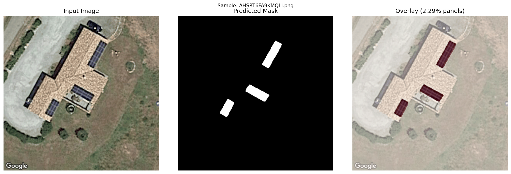
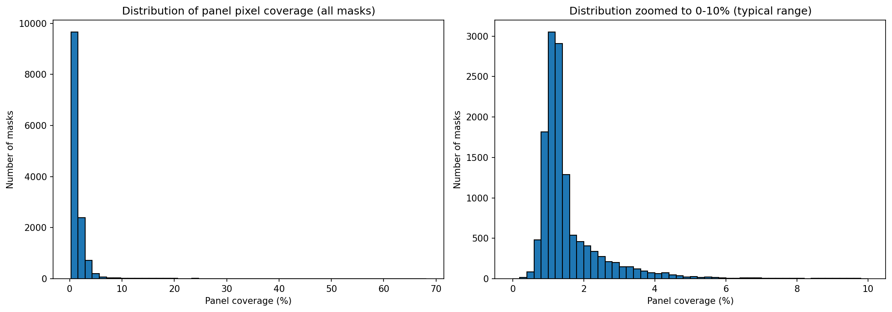

# Solar Panel Segmentation from Aerial Imagery

End-to-end deep learning pipeline for detecting and segmenting solar panels in aerial imagery, deployed as a public REST API with interactive demo.

**Live Demo**: https://solar-panel-segmentation-4.streamlit.app/

**API Docs**: https://solar-panel-segmentation-655838531680.europe-west1.run.app/docs
---

## Results

- **Best validation IoU: 88.25%** (U-Net with ResNet34 encoder, 30 epochs)
- **Inference time**: ~500ms CPU local, ~50ms on GPU
- **Dataset**: BDAPPV (13,303 annotated aerial image/mask pairs)

## Sample Predictions



*Left: aerial image. Center: predicted mask. Right: overlay showing detected panels*



*Distribution of panel pixel coverage across 13,303 samples. Mean coverage 1.85%.*

---

## Problem

Mapping rooftop solar installations from aerial imagery has real-world applications in utility grid management, renewable energy policy tracking, and urban planning. This project builds an automated pipeline that takes an aerial image and produces a pixel-level mask of solar panel locations, served as a production REST API.

---

## Tech Stack

| Category | Tools |
|---|---|
| Deep Learning | PyTorch, segmentation-models-pytorch |
| Architecture | U-Net with ResNet34 encoder (ImageNet pretrained) |
| Data | BDAPPV dataset (Kasmi et al., 2023) |
| Augmentation | Albumentations |
| API | FastAPI, Uvicorn |
| Containerization | Docker |
| Cloud | Google Cloud Run (europe-west1) |
| Storage | Google Cloud Storage (model weights) |

---

## Key Design Decisions

**Why Dice loss over cross-entropy?**
Solar panels occupy only 1.85% of pixels on average. Cross-entropy lets the model cheat by predicting all-background and still score 98% accuracy. Dice loss ignores background pixels entirely, forcing the model to actually find panels.

**Why IoU as the metric?**
Same reason. A model predicting no panels gets 98% pixel accuracy but 0% IoU. IoU only measures overlap between predicted and true panel regions.

**Why pretrained ResNet34 encoder?**
Transfer learning from ImageNet converges faster and performs better than training from scratch on 13k samples. The encoder already knows edges, textures, and shapes.

**Why U-Net architecture?**
The encoder-decoder structure with skip connections preserves both semantic understanding (what is a panel) and spatial precision (where exactly are the pixels). Essential for dense pixel-level prediction.

---

## Dataset

BDAPPV (Building Detected at the Patch Level for PV) — Kasmi et al., 2023

- 13,303 image/mask pairs from Google aerial imagery (France)
- All images 400×400 RGB, masks binary (panel vs background)
- Mean panel coverage: 1.85% (severe class imbalance)
- Source: https://zenodo.org/records/7358126

---

## Setup

```bash
git clone https://github.com/m-umar-raza/solar-panel-segmentation.git
cd solar-panel-segmentation

python -m venv venv
source venv/Scripts/activate  # Git Bash on Windows
pip install -r requirements.txt

# download dataset
mkdir -p data/raw && cd data/raw
curl -L -o bdappv.zip "https://zenodo.org/records/7358126/files/bdappv.zip?download=1"
unzip -q bdappv.zip
```

---

## Usage

**Via the live API:**

```bash
curl -X POST "https://solar-panel-segmentation-655838531680.europe-west1.run.app/predict" \
  -F "file=@your_aerial_image.png"
```

Response:
```json
{
  "panel_coverage_percent": 1.72,
  "mask_base64": "...",
  "inference_time_ms": 324.17,
  "image_size": [400, 400]
}
```

**Run locally:**

```bash
uvicorn src.api.main:app --reload --host 0.0.0.0 --port 8000
```

Then open http://localhost:8000/docs

**Run with Docker:**

```bash
docker build -t solar-panel-segmentation .
docker run -p 8080:8080 solar-panel-segmentation
```

---

## Training

Training ran on Kaggle free GPU (Tesla T4), 30 epochs, batch size 8:

```python
from src.training.train import train

train(
    data_dir="data/raw/bdappv/google",
    epochs=30,
    batch_size=8,
    device="cuda",
    save_path="models/best_model.pth",
)
```

Loss decreased from ~0.97 (random init) to 0.0425 by epoch 30. IoU improved consistently across all epochs, reaching 88.25% on the held-out validation set.

---

## Project Structure
solar-panel-segmentation/
├── src/
│   ├── data/
│   │   └── dataset.py          # PyTorch Dataset class
│   ├── models/
│   │   └── unet.py             # U-Net builder
│   ├── training/
│   │   ├── train.py            # training loop
│   │   └── losses.py           # Dice loss and IoU metric
│   └── api/
│       └── main.py             # FastAPI inference service
├── notebooks/
│   └── 01_eda.ipynb            # dataset exploration
├── Dockerfile
├── start.sh
└── requirements-docker.txt

---

## Limitations

- Targets roof-mounted panels visible in nadir aerial imagery only
- Facade-mounted and balcony installations (Balkonkraftwerk) out of scope due to viewing angle
- Trained on French imagery; performance may vary on other geographies (distribution shift)
- CPU inference ~500ms; GPU would reduce to under 50ms

---

## References

- Kasmi, G. et al. (2023). A crowdsourced dataset of aerial images with annotated solar photovoltaic arrays. *Scientific Data*, 10, 59. https://doi.org/10.1038/s41597-023-01951-4
- Ronneberger, O., Fischer, P., & Brox, T. (2015). U-Net: Convolutional networks for biomedical image segmentation. *MICCAI 2015*. arXiv:1505.04597

---

## Author

[Umar Raza](https://github.com/m-umar-raza)
